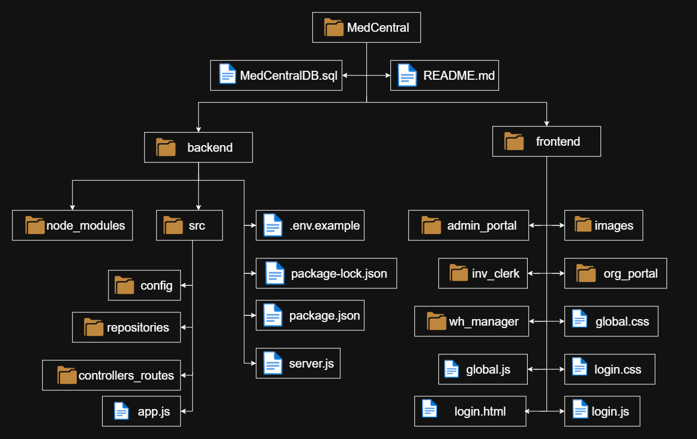
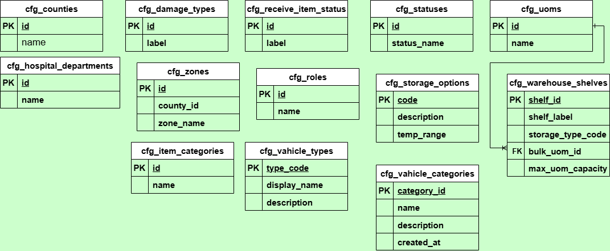
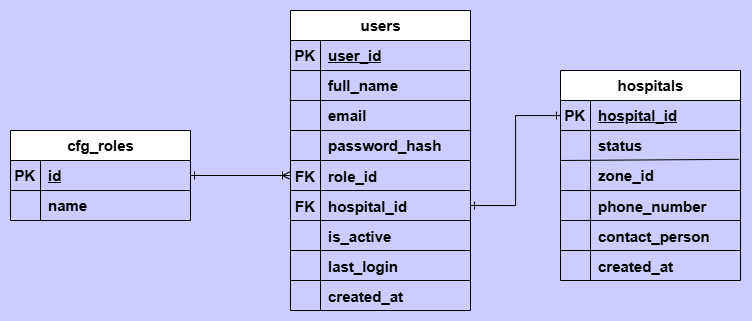
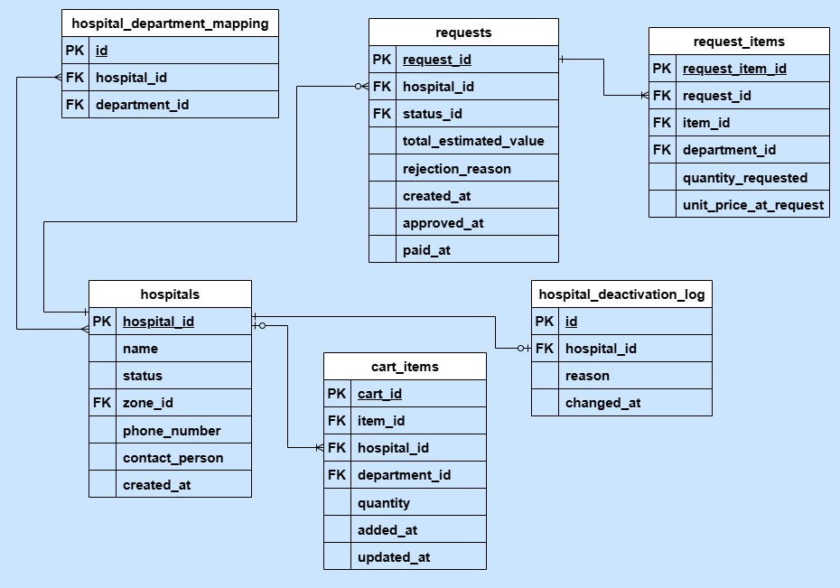
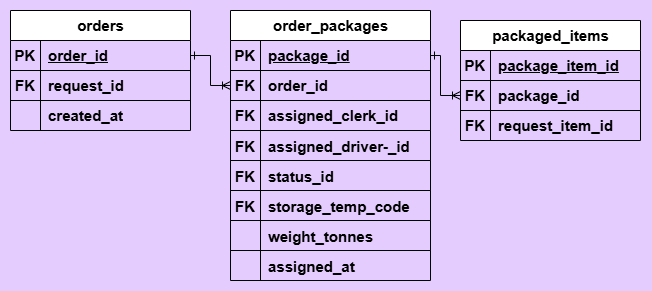

# MedCentralis: A Medical Central Warehouse Ordering and Distribution System 🏥

## 📖 Overview
MedCentralis is a centralized digital application for managing the ordering, inventory, and 
distribution of medical supplies from a central warehouse to healthcare institutions. It 
enables users to manage warehouse stock, process hospital orders, track deliveries, and 
record issues with received supplies.

The name “MedCentralis” comes from two words “Medical” and “Centralis”(Latin) which together describe 
a central place where medical supplies can be managed and distributed.

The system is intended for **administrators, warehouse managers, inventory clerks, hospital staff, and drivers** 
involved in the medical supply distribution process. It addresses challenges such as poor inventory visibility, 
inefficient order processing, limited order tracking, and difficulties recording damaged, expired, or incorrect deliveries.

The main purpose of MedCentral is to **streamline and centralize medical supply management** by providing a 
structured process from hospital order requests through warehouse fulfillment, dispatch, delivery, and confirmation. 
This improves inventory visibility, operational efficiency, distribution tracking, and accountability.

## 🎯 Problem Statement
Medical central warehouses face challenges in efficiently managing inventory, processing healthcare institution orders, 
and tracking the distribution of medical supplies. Existing manual or fragmented approaches often rely on paper records, 
spreadsheets, phone calls, and separate communication channels, making it difficult to maintain accurate and up-to-date 
information throughout the supply process.

These approaches are **time-consuming, prone to human error, and provide limited visibility** into stock levels, order progress, 
and delivery issues. Warehouse personnel may struggle to identify low-stock items and track stock movements, while healthcare 
institutions may have difficulty monitoring their orders and confirming the condition of received supplies. These challenges 
affect **warehouse staff, healthcare institutions, and ultimately the availability of medical supplies**.

A centralized software solution is useful because it can bring inventory, ordering, distribution, and delivery tracking into one 
system. MedCentralis can organize these processes, improve information accuracy and visibility, provide timely updates on orders 
and stock levels, and maintain records of distribution and delivery issues, resulting in more efficient and accountable medical 
supply management.

## 🎯 Objectives
### Main Objective
To design and develop a centralized system that simplifies and improves the process of ordering and distributing medical supplies 
between health facilities and the central warehouse. 

### Specific Objectives
1. Receiving and verification of new stock by capturing supplier details, quantities received 
and batch information. 
2. Enable warehouse staff to monitor stock levels and record incoming and outgoing medical 
items efficiently. 
3. Monitor and manage stock shortages through automated alerts and color-coded 
notifications for low stock. 
4. Allow health facilities to make supply requests online and track the progress of their orders 
in real time. 
5. Store electronic records of all transactions and generate reports for better tracking, 
decision-making, and accountability.

## ✨ Features
### User Management

* **User registration and authentication** – Secure account creation and login for authorized users.
* **Role-based access control** – Assign permissions based on roles such as Administrator, Warehouse Manager, Inventory Clerk, and Hospital Staff.
* **Profile management** – Allow users to view and update their account information.

### Core Functionality

* **Inventory Management** – Manage medical items, stock levels, categories, storage conditions, and minimum stock levels.
* **Order Management** – Allow hospitals to submit orders and warehouse staff to approve, process, pack, and track them.
* **Distribution & Delivery Tracking** – Manage packages, dispatches, deliveries, and record issues such as damaged, expired, or incorrect items.

### Reporting & Analytics

* **Dashboard** – Provide an overview of inventory, orders, stock status, and distribution activities.
* **Reports** – Generate inventory stock, low-stock, and issues reports.
* **Data visualization** – Present key information using charts, graphs, and summary indicators.

### Security

* **Password hashing** – Store user passwords securely using hashing.
* **Authentication** – Verify user identity before granting access to the system.
* **Authorization** – Restrict system functions and data according to user roles and permissions.
* **Input validation** – Validate user-provided data to reduce invalid or potentially harmful input.

## 🛠️ Technology Stack

| Category | Technology |
| --- | --- |
| Frontend | HTML, CSS, JavaScript |
| Backend | Node.js, Express |
| Database | PostgreSQL |
| API | REST API |
| Version Control | Git & Github |
| Development Environment | VS Code |

## 📁 Project Structure

 

| Folder/File | Description |
| --- | --- |
| MedCentral | Root Folder |
| MedCentralDB.sql | SQL script used to create the MedCentral database and its required tables and data. |
|    |     |
| backend | Contains backend files |
|    |     |
| node_modules | Contains the Node.js packages and dependencies required by the backend. |
| src | Contains the main backend source code and application logic. |
| config | Contains the database configuration and connection code. |
| repositories | Contains SQL queries used to perform database operations. |
| controllers_routes | Contains controllers and routes that handle requests and connect the API to the application logic. |
| app.js | Configures the backend application, including middleware and API settings. |
| env.example | Template showing the environment variables required to configure the backend. |
| package-lock.json | Records the exact versions of installed Node.js dependencies. |
| package.json | Defines the project metadata, scripts, and required Node.js dependencies. |
| server.js | Starts the backend server and listens for incoming requests. |
|    |    |
| frontend | Contains the frontend files |
|    |    |
| admin_portal | Contains the HTML, CSS, and JavaScript files for the administrator interface. |
| images | Contains images and other visual assets used throughout the system. |
| inv_clerk | Contains the HTML, CSS, and JavaScript files for the inventory clerk interface. |
| org_portal | Contains the HTML, CSS, and JavaScript files for the hospital/organization interface. |
| wh_manager | Contains the HTML, CSS, and JavaScript files for the warehouse manager interface. |
| global.css | Contains CSS styles shared across different parts of the system. |
| global.js | Contains JavaScript functions that are reused across multiple pages. |
| login.css | Contains the CSS styles for the login interface. |
| login.html | Defines the structure and elements of the system's login interface. |
| login.js | Contains the JavaScript functionality for the login interface. |

## 🗄️ Database Design
The system consists of 33 tables.  
To clearly display their relationship they have been divided into functional modules which include:

**Configuration Module**  

These are the "static" or reference tables that provide the dropdown options and constraints for the 
rest of the system. 



**User Management Module**  
The users table contains credentials and links users to either a Hospital (for requesting) or a Role 
(Clerk/Warehouse Manager for warehouse operations or Administrator).



**Hospital and Requests Module**  
The "Front-End" module where healthcare facilities interact with the warehouse. 



**Order Fulfillment and Packing Module**  
The "Internal Workflow" where requests become physical packages ready for travel.



To view/create all the tables use the [MedCentralDB.sql](MedCentralDB.sql) file.

## ⚙️ Installation

**Prerequisites**

Make sure you have installed:

* Git
* Node.js
* npm
* PostgreSQL

**Clone the Repository**
```
git clone https://github.com/gitcodmax/MedCentral-System.git
cd MedCentral-System
```

**Install Dependencies**
```
npm install bcrypt cors dotenv express jsonwebtoken nodemon pg
```

## 🔐 Configuration

Create a ```.env``` file in the project root:

```
PORT='3000'
DB_USER='database_user'
DB_HOST='localhost'
DB_NAME='database_name'
DB_PASSWORD='database_password'
DB_PORT='your_database_port'
JWT_SECRET='your_jwt_secret'
```

```.env.example``` file contains the variables that are needed.
